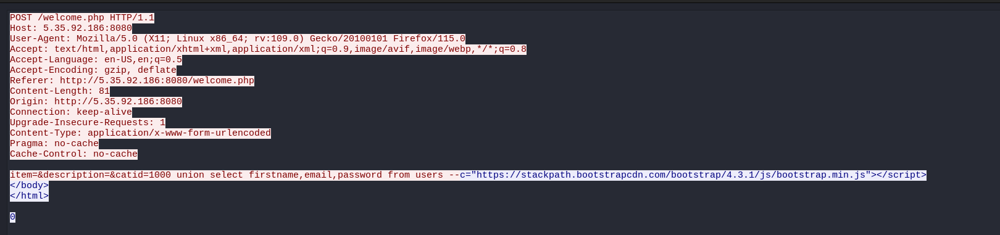

1. Open the pcap file with wireshark
2. Follow the HTTP stream or filter our rest of the http requests:

3. In the post request body you will find leaked login and passwords

Also note that inside the file there was a hints was left for another task also (Juice shop SQLi)
 