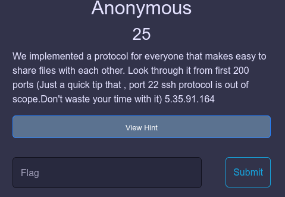
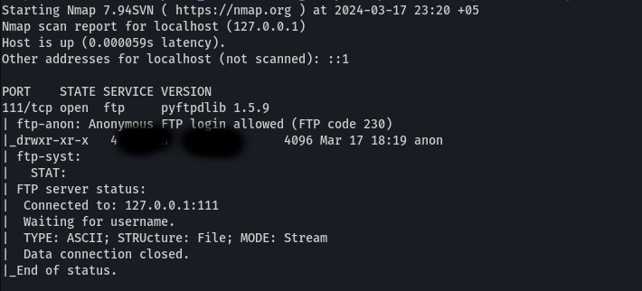
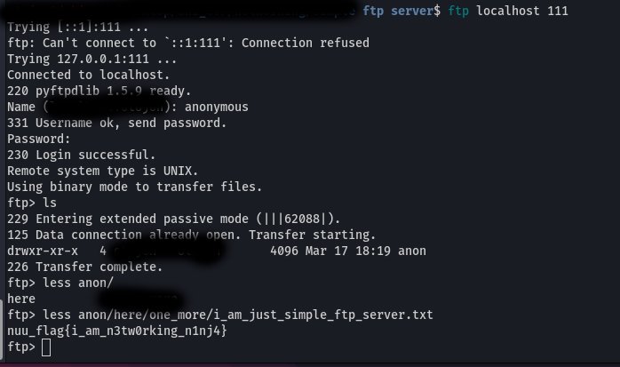

1. Scan the host with port scanner tools(nmap is recommended) `$ nmap {server address}`. About nmap => https://nmap.org/
2. It will find 2 open addresses 22 (ssh) and 111 (ftp)
3. It was mentioned that ssh was out of scope 
4. Scan the specific port 111 `$ nmap {server address} -p111 -sC -sV` 

5. Observe the anonymous login allowed
6. try `$ftp {server address} 111`,`USER: anonymous` , `PASS: anonymous`
7. 