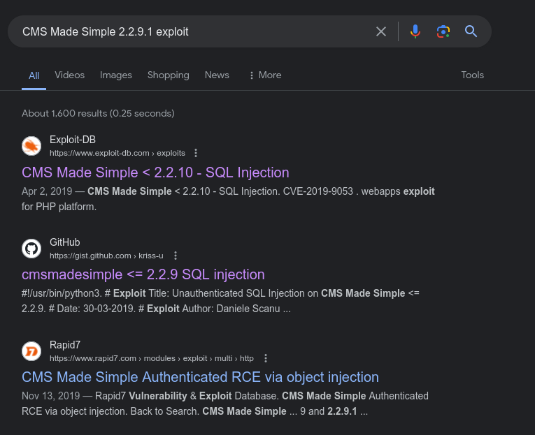

1. Grab the  version from the footer of the index page `CMS Made Simple 2.2.9.1`
2. Search the exploits online 
(in case SQLi was exploited there was a chance to upgrade it to Remote Code Execution also)
3. You were free to use  publicly known exploits or manual work to extract info from database