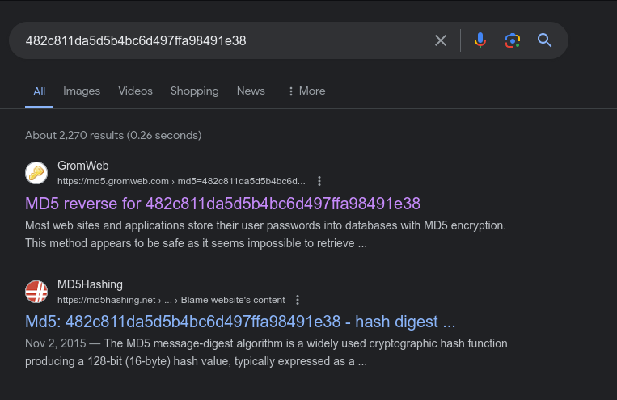

1. Go to the `/about.html` and inspect the page
2. Grab the admin login and password hash
3. Crack the hash or just search it online: 
4. Login to the profile
5. Click the profile image 
6. Pay attention to the url bar `http//{server}:1337/view_image.php?filename=profile.jpg`
7. Change `?filename=` parameter to other filenames that escapes from the current `/uploads` folder 
```php
$filename = $_GET['filename'] ?? '';
$filepath = "uploads/" . $filename; // path traversal vulnerability
``` 
8. Inspect `/about.html` that take note the path of `flag,txt` file and you should go back 2 folders to download it 
`http//{server}:1337/view_image.php?filename=../../readme/flag.txt`
